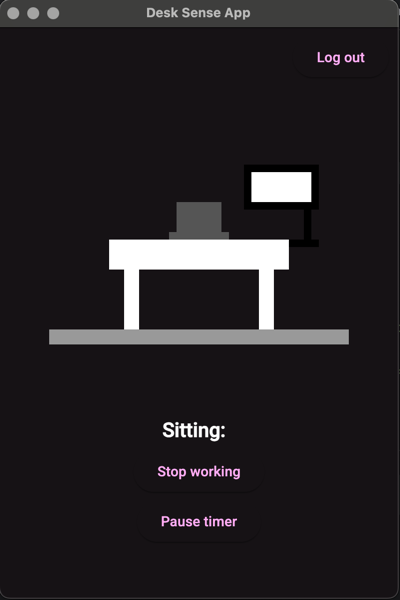

# Desk Sense – Sit/Stand Tracker with ESP32

**Desk Sense** is a smart desk activity tracker powered by an ESP32. It monitors how long a person is sitting or standing at their desk and sends real-time data to FireBase for analytics and reminders.

